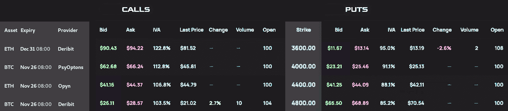

# 

 | Rainbow is a dashboard for Decentralized Finance options trading. <br><br> It's developed during Solana's Ignition & Ethereum's EthGlobal Hackathons by members of [Teal.Finance](https://teal.finance/).
---|---

## Motivation

The crypto derivatives markets are expected
to grow a lot more in the upcoming years.
Specifically, the options markets will see the bigger growth.

In traditional finance, option market is much bigger
than the underlying assets market.
This is lagging in Crypto, when we look at Deribit's volume,
the main (centralized) venue for Crypto Options,
compared to Perpetuals future.

**Rainbow** profits from the following trends:

* Crypto-assets and DeFi becoming mainstream,

* DeFi composability & complexity abstraction
  for easy onboarding of users,

* Advent of the Internet of Blockchains’ world
  with more cross-chain applications and communications,

* Crypto options trading growing (hopefully) bigger
  than the spot market, like in tradFi.

## Target

**Rainbow** is a first step in that direction:
a place where users, traders and market makers can see
the options, prices, expiries, liquidities across layers L1/L2.

## Current status

The current version is a tool to compare market data
across multiple venues, CEX and DEXes.

Deribit is supported since the beginning, because Deribit
is the main options trading place.

Opyn is also supported, because we are active users of this protocol.
Opyn use the 0x Protocol for the exchange of their options.
Rainbow uses both Opyn and 0x APIs to retrieve their trading data.
TheGraph is also used to list the available options from Opyn.

Most recently, PsyOptions (from the Solana ecosystem) has also been integrated.
PsyOptions is the main DeFi options protocol.

More Ethereum and Solana protocols are planed to also be supported
in the near future: Thales, Lyra, Hegic...

Now, using Rainbow, you can compare to arbitrage options
across these markets, or simply get the best prices.

## Technology

The back-end is developed in Go.

Deribit API is well documented, and the data retrieval
was pretty straightforward to implement.
Deribit even have an API playground, which all projects should also provide.

To support Opyn, Rainbow retrieves the options list using the TheGraph API.
This is our first GraphQL client implementation in Go and we spent days
to test and compare the different solutions:
we are proud to use the GraphQL state-of-the-art in Go,
based on the library <https://github.com/Khan/genqlient>
with type-safe code generation.
We got help from the Opyn team for the query examples.

Opyn support also requires to use the 0x protocol.
We have battled to correctly get the bid/ask prices from 0x API.
We got some help from the 0x team to identify which API call was the most suitable.
This help advances our work a lot and enables us to add,
in a near future, other protocols like Thales.

To support PsyOptions, we took our first plunge
in the Solana ecosystem to understand and use the Serum Go library.

See also the Go documentation: <https://pkg.go.dev/github.com/teal-finance/rainbow>

Next step is to implement on a proper UI that enables users to trade,
based on Typescript/Vue3.

## Build

    git clone https://github.com/teal-finance/rainbow
    cd rainbow
    go generate ./...

### CLI

You may just use the pretty nice table printed by the command `./cli`.

    go build ./cmd/cli && ./cli


### Back-end

If you prefer the API, use `./server`.

    go build ./cmd/server && ./server -dev

The flag `-dev` enables CORS for `http://localhost:*`.

### Front-end

This project also provides a pretty nice Vue3 front-end that uses the API.

    cd frontend
    yarn
    yarn dev

## Container

See also the [Dockerfile](Dockerfile) for a light container image: 30 MB.

The image contains the hardened sever executable (with dynamic library) and the front-end.

The container enables by default the CORS, the export ports and a rate limiter.
Some of these features can be customized using environments variables.

The Dockerfile has been successfully tested with Docker-20.10.8 and Podman-3.3.1.

## Command line flags

Rainbow provides a complete HTTP server,
including a rate limiter, an export port (Prometheus monitoring),
and more. For more details see the underlying project
[Teal.Finance/Server](https://github.com/teal-finance/teal/).

```
$ go build ./cmd/server
$ ./server -help
Usage of ./server:
  -addr string
        Schema and DNS used for doc URL and CORS, has precedence over MAIN_ADDR (default "http://localhost")
  -burst int
        Max requests during a burst, has precedence over REQ_BURST (default 10)
  -dev
        Run rainbow in dev. mode
  -exp int
        Export port for Prometheus, has precedence over EXP_PORT
  -opa string
        Policy files (comma-separated filenames) for the Open Policy Agent using the Datalog/Rego format
  -port int
        API port, has precedence over MAIN_PORT (default 8090)
  -rate int
        Max requests per minute, has precedence over REQ_PER_MINUTE (default 30)
  -www string
        Folder of the web static files, has precedence over WWW_DIR (default "frontend/dist")
```

## API

### /v0/options

List all the options and their order books: <http://localhost:8090/v0/options>

```js
{
  "Name": "ETH-2021-10-29 23:59:59-3200-PUT",
  "Expiry": "2021-10-29 23:59:59",
  "Type": "PUT",
  "Asset": "ETH",             // ETH, BTC, SOL
  "Strike": 3200,
  "ExchangeType": "DEX",      // CEX or DEX
  "Chain": "Solana",          // Ethereum, Solana...
  "Layer": "L1",
  "Provider": "PsyOptions",   // Opyn, Lyra, Thales, Deribit, Psyoptions
  "Bid": [
    {
      "Price": 13.3,
      "Quantity": 5,
      "QuoteCurrency": "USDC" // ETH, BTC...
    },
    {
      "Price": 13.1,
      "Quantity": 10,
      "QuoteCurrency": "USDC"
    }
  ],
  "Ask": [
    {
      "Price": 15.12,
      "Quantity": 5,
      "QuoteCurrency": "USDC"
    },
    {
      "Price": 15.25,
      "Quantity": 9,
      "QuoteCurrency": "USDC"
    }
  ]
}
```

### /v0/options/cp

List the options in Call/Put format: <http://localhost:8090/v0/options/cp>

Rainbow API is currently only used by its web front-end and has been influenced by
the [BFF pattern](https://blog.bitsrc.io/e4fa965128bf) (Backend for Frontend pattern).
This endpoints aims simplifying the front-end processing.



```js
{ "rows":[
    { "asset": "ETH",
      "expiry": "Dec 31 08:00",
      "provider": "Deribit",
      "call": { "bid": {"px": 0.1805, "size": 24},
                "ask":  {"px": 0.183,  "size": 459},
                "other_indicators_will_be_added_soon": 0},
      "strike": 4400,
      "put": { "bid": {"px": 0.1305, "size": 26},
               "ask": {"px": 0.133, "size": 37},
               "other_indicators_will_be_added_soon": 0}
    },
    { "asset": "ETH",
      "expiry": "Dec 31 08:00",
      "provider": "Deribit",
      "call": { "bid": {"px": 0.114, "size": 258},
                "ask": {"px": 0.116,"size": 33},
                "other_indicators_will_be_added_soon": 0},
      "strike": 5200,
      "put": { "bid": {"px": 0.1235, "size": 80},
               "ask": {"px": 0, "size": 0},
               "other_indicators_will_be_added_soon": 0}
    },

  // [...]

  { "asset": "BTC",
    "expiry": "Nov 26 08:00",
    "provider": "Deribit",
    "call": { "bid": {"px":0.2045, "size":7.5},
              "ask": {"px":0.2105, "size":5.3},
              "other_indicators_will_be_added_soon":0},
    "strike":50000,
    "put": { "bid": {"px":0.0125, "size":27.2},
             "ask": {"px":0.0135, "size":70.2},
             "other_indicators_will_be_added_soon":0}}
]}
```
