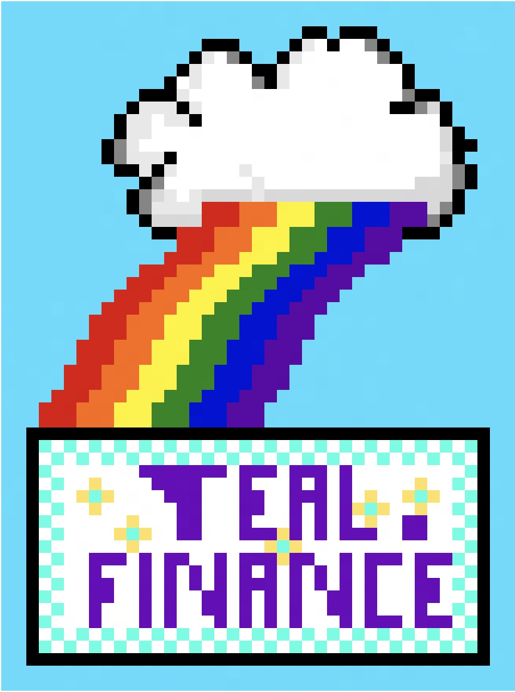

# Rainbow


**Rainbow** is a dashboard for Decentralized Finance Options trading.
It's developed during Solana's Ignition & Ethereum's EthGlobal Hackathons
by some members of [Teal Finance](https://teal.finance/).

## The Pitch

The Crypto derivatives markets are expected to grow a lot more in the upcoming years.
Specifically, the Options markets will see the bigger growth.
In traditional finance, Option Market is much bigger than the underlying asset market.
This is lagging in Crypto, when we look at Deribit's volume,
the main (centralized) venue for Crypto Options, compared to Perpetuals future.
We want to surf on three trends:

* Cryptocurrencies becoming mainstream,
* DeFi composability & complexity abstraction for easy onboarding of users,
* Advent of the Internet of Blockchains’ world with more cross-chain applications and communications.

**Rainbow** is a first step in that direction:
a place where users, traders and market makers can see
the options, prices, expiries, liquidities across L1/L2.

## Data structure

Options

```js
{
  "name":"Ethereum-5000-C",
  "options":"call",        // call or put
  "asset":"ETH",           // ETH, BTC, SOL
  "expiry":"31/12/2021",
  "strike":5000,
  "blockchain":"Ethereum", // Ethereum, Solana…
  "Layer":1,               // L1 or L2
  "provider": "Opyn",      // Opyn, Lyra, Thales, Deribit, Psyoptions
  "offers": []
}
```

----
Offers

```js
{
  "side": "buy",      // buy/sell
  "price":"0.1",
  "currency": "ETH",  // ETH, BTC, DOLLARS
  "quantity": 5
}
```
